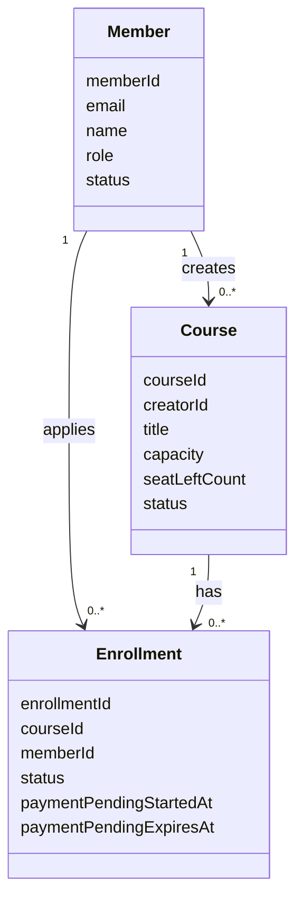
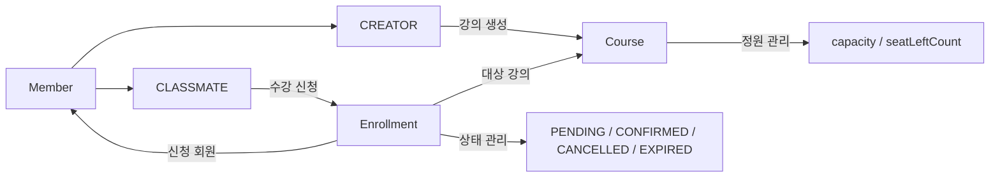

## 설계 결정과 이유

### 도메인 중심 설계

회원, 강의, 수강 신청을 각각 독립된 도메인으로 나누었습니다.

- [Member](/docs/domain/member.md)
- [Course](/docs/domain/course.md)
- [Enrollment](/docs/domain/enrollment.md)

각 도메인은 자신의 상태와 규칙을 직접 관리하도록 설계했습니다.  

도메인간 행위 흐름은 다음과 같습니다.

### 정원 초과 방지

수강 신청은 강의 정원을 초과하면 안 됩니다.

이를 위해 좌석을 먼저 확보한 경우에만 수강 신청을 생성하도록 설계했습니다.  
동시에 여러 사용자가 신청하더라도 성공한 신청 수가 정원을 넘지 않도록 했습니다.

성능 관점에서는 `X-LOCK` 같은 동시 제어 방식은 좋지 못합니다.
`SELECT FOR UPDATE`를 제거하고 `UPDATE`를 사용한 수량 조절로 락 범위를 줄여야합니다.
그렇지만 이것 또한 강한 부하가 발생하는 상황에서는 장애로 이어질 것으로 판단하여 대기열 처리를 추가하여 데이터베이스로 요청이 몰리는 상황을 최소화 해야합니다.  
그래서 수강 신청 경로는 Redis 대기열 확인과 DB 쓰기 경로를 분리하고, 쓰기 횟수와 락을 잡는 시간을 줄이는 방향으로 다뤘습니다.

### 수강 신청 상태 관리

수강 신청은 `PENDING`, `CONFIRMED`, `CANCELLED`, `EXPIRED` 상태로 관리합니다.

`PENDING`은 결제 대기 상태이지만 좌석을 점유합니다.  
`CONFIRMED`는 결제 확정 상태입니다.  
`CANCELLED`는 사용자가 직접 취소한 상태이고, `EXPIRED`는 결제 대기 시간이 지나 만료된 상태입니다.

### 결제 대기 만료

`PENDING` 상태는 좌석을 점유하므로 무기한 유지되면 안 됩니다.

이를 위해 스케줄러가 주기적으로 결제 대기 시간이 지난 `PENDING` 신청을 찾아 `EnrollmentExpirationProcessor`에 전달하고,
프로세서가 `EXPIRED`로 변경한 뒤 점유하던 좌석을 반환합니다.

스케줄러는 만료 실행 시점만 담당하고, 만료된 좌석의 대기열 승격은 전용 서비스가 처리합니다.
좌석이 반환되면 waitlist mode를 바로 해제하지 않고 대기열 선두 회원을 먼저 승격합니다.

이 결정은 결제하지 않은 신청이 좌석을 계속 차지하는 문제와, 반환 좌석을 신규 신청자가 먼저 가져가는 문제를 함께 막기 위한 것입니다.

### 재신청 정책

같은 회원과 강의에 대해 `PENDING` 또는 `CONFIRMED` 신청이 있으면 중복 신청으로 처리합니다.

`CANCELLED` 또는 `EXPIRED` 신청은 더 이상 좌석을 점유하지 않으므로 같은 강의에 다시 신청할 수 있게 했습니다.

이때 회원과 강의 조합의 유일성은 유지하면서, 기존 신청 식별자를 재사용해 새 `PENDING` 신청으로 갱신합니다.

이 결정은 취소나 결제 대기 만료 이후에도 사용자가 다시 좌석 확보를 시도할 수 있어야 하기 때문입니다.

### 대기열 처리

정원이 가득 찬 강의에 신청하면 바로 수강 신청을 생성하지 않고 대기열에 등록합니다.

대기열은 Redis `ZSET`으로 관리했습니다. 회원 ID를 값으로 저장하고, 신청 시각을 점수로 사용해 강의별 대기 순서를 표현하기 위해서입니다.

취소나 결제 대기 만료로 좌석이 반환되면 매진 상태를 즉시 해제하지 않습니다.
대기열 선두 회원을 먼저 `PENDING`으로 승격하고, 대기자가 남아 있으면 waitlist mode를 유지합니다.
대기열이 비었을 때만 waitlist mode를 해제하여 신규 신청자가 기존 대기자보다 먼저 좌석을 가져가지 못하게 합니다.

대기열에 등록된 사용자는 아직 좌석을 확보한 것이 아니므로 수강 신청 성공자로 보지 않습니다.

대신 API는 대기열 등록 응답을 돌려주어 사용자가 현재 상태를 바로 알 수 있게 했습니다.

에러 처리 방식이 아닌 응답 반환 방식을 사용하여 advice까지 전달되지 않고 바로 응답하도록 처리해 응답 비용을 감축시키도록 설계했습니다.

### 트랜잭션 경계

Redis 대기열 등록, 조회, 취소는 DB 트랜잭션 범위 밖에서 처리합니다.

DB 트랜잭션은 좌석 확보, 수강 신청 저장, 결제 확정, 수강 취소처럼 MySQL 정합성이 필요한 작업에만 사용합니다.

이 결정은 Redis 작업이 DB 락 보유 시간을 늘리지 않도록 하고, 수강 신청 경로의 쓰기 횟수와 트랜잭션 점유 시간을 줄이기 위한 것입니다.

### 승격 처리 순서

대기열 승격은 Redis에서 먼저 제거하지 않습니다.

흐름은 `peek → DB 승격 성공 → Redis remove` 순서입니다.
DB 승격 중 예외가 발생하면 해당 대기자는 Redis에 남겨 다음 실행에서 다시 처리할 수 있게 합니다.
대기열 선두 데이터가 유효하지 않은 경우에만 제거하고 다음 대기자를 확인합니다.

이 결정은 Redis와 DB가 함께 바뀌는 구간에서 대기자 유실을 막고, 좌석 반환 후 대기열 공정성을 보장하기 위한 것입니다.

### Batch 처리

결제 대기 만료는 만료 대상 신청을 batch로 `EXPIRED` 처리하고, 강의별 만료 수량만큼 좌석을 반환합니다.
반환된 좌석은 강의별 수량만큼 대기열 승격 흐름에 넘깁니다.

이 결정은 스케줄러가 많은 만료 대상을 처리할 때 DB 왕복과 쓰기 횟수를 줄이면서도, 좌석 배정 순서는 대기열 정책을 따르게 하기 위한 것입니다.
