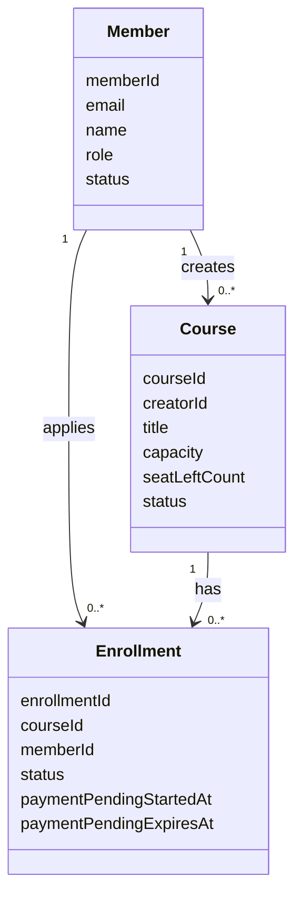
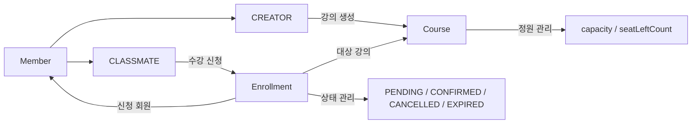

## 설계 결정과 이유

### 도메인 중심 설계

회원, 강의, 수강 신청을 각각 독립된 도메인으로 나누었습니다.

- [Member](/docs/domain/member.md)
- [Course](/docs/domain/course.md)
- [Enrollment](/docs/domain/enrollment.md)

각 도메인은 자신의 상태와 규칙을 직접 관리하도록 설계했습니다.  

도메인간 행위 흐름은 다음과 같습니다.

### 정원 초과 방지

수강 신청은 강의 정원을 초과하면 안 됩니다.

이를 위해 좌석을 먼저 확보한 경우에만 수강 신청을 생성하도록 설계했습니다.  
동시에 여러 사용자가 신청하더라도 성공한 신청 수가 정원을 넘지 않도록 했습니다.

### 수강 신청 상태 관리

수강 신청은 `PENDING`, `CONFIRMED`, `CANCELLED`, `EXPIRED` 상태로 관리합니다.

`PENDING`은 결제 대기 상태이지만 좌석을 점유합니다.  
`CONFIRMED`는 결제 확정 상태입니다.  
`CANCELLED`는 사용자가 직접 취소한 상태이고, `EXPIRED`는 결제 대기 시간이 지나 만료된 상태입니다.

### 결제 대기 만료

`PENDING` 상태는 좌석을 점유하므로 무기한 유지되면 안 됩니다.

이를 위해 스케줄러가 주기적으로 결제 대기 시간이 지난 `PENDING` 신청을 찾아 `EnrollmentExpirationProcessor`에 전달하고,
프로세서가 `EXPIRED`로 변경한 뒤 점유하던 좌석을 반환합니다.

스케줄러는 만료가 실제로 발생한 강의의 대기열 `sold-out` 상태만 해제합니다.

이 결정은 결제하지 않은 신청이 좌석을 계속 차지하는 문제를 막기 위한 것입니다.

### 대기열 처리

정원이 가득 찬 강의에 신청하면 바로 수강 신청을 생성하지 않고 대기열에 등록합니다.

대기열은 Redis `ZSET`으로 관리했습니다. 회원 ID를 값으로 저장하고, 신청 시각을 점수로 사용해 강의별 대기 순서를 표현하기 위해서입니다.

취소나 결제 대기 만료로 좌석이 반환되면 이후 요청이 다시 좌석 확보를 시도할 수 있도록 매진 상태를 해제합니다.

대기열에 등록된 사용자는 아직 좌석을 확보한 것이 아니므로 수강 신청 성공자로 보지 않습니다.
