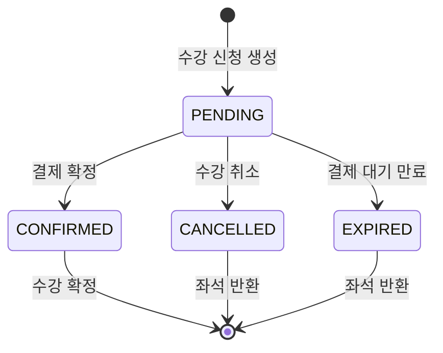

## 해석이 필요한 요구사항 범위

### 1. 정원 초과 방지

정원은 강의에 신청할 수 있는 최대 인원으로 보았습니다.

수강 신청이 성공하면 그 사용자는 좌석을 차지합니다.
따라서 성공한 신청 수는 정원을 넘을 수 없습니다.

결제 전인 `PENDING` 상태도 이미 신청이 완료된 상태이므로 좌석을 차지한다고 보았습니다.  
`CONFIRMED`도 좌석을 차지합니다.

반대로 `CANCELLED`와 `EXPIRED`는 더 이상 좌석을 차지하지 않는 상태로 보았습니다.

정리하면 다음과 같습니다.

`PENDING`, `CONFIRMED`: 정원에 포함  
`CANCELLED`, `EXPIRED`: 정원에 포함하지 않음

### 2. 동시 수강 신청 처리

여러 사용자가 같은 강의에 동시에 신청할 수 있다고 보았습니다.

특히 마지막 한 자리에 여러 명이 동시에 신청해도, 성공한 신청 수가 정원을 넘으면 안 됩니다.

동시 신청 상황에서 정원 초과 방지는 보장은 필요하지만, 요청 도착 순서에 따른 완전한 선착순 보장은 요구되지 않는것으로 이해했습니다.

동시에 요청이 들어오면 일부만 성공하고, 나머지는 실패하거나 대기열로 이동할 수 있다고 보았습니다.

### 3. 결제 확정 처리

외부 결제 시스템은 구현하지 않는다고 보았습니다.

따라서 결제 확정은 실제 결제가 아니라, 신청 상태를 바꾸는 것으로 구현해도 된다고 보았습니다.

상태 흐름은 다음과 같습니다.

`PENDING -> CONFIRMED`

`PENDING` 상태의 신청만 확정할 수 있습니다.  

이미 `CONFIRMED`, `CANCELLED`, `EXPIRED` 상태라면 다시 확정할 수 없습니다.

결제 확정은 이미 잡아둔 좌석을 확정하는 과정이므로, 좌석 수를 새로 바꾸는 행위는 아니라고 보았습니다.

### 4. 결제 대기 만료

`PENDING`은 좌석을 차지하는 상태입니다.

그런데 사용자가 결제를 하지 않은 채 오래 방치하면 좌석이 계속 막히는 문제가 생깁니다.

그래서 결제 대기 시간이 지나면 신청을 만료된 상태로 바꾼다고 보았습니다.

상태 흐름은 다음과 같습니다.

`PENDING -> EXPIRED`

`EXPIRED`는 사용자가 직접 취소한 것이 아니라, 결제 대기 시간이 지나 자동으로 만료된 상태입니다.

만료된 신청은 현재 신청 인원에 포함하지 않습니다.

### 5. 수강 취소 범위

수강 취소는 결제 대기 상태에서만 가능하다고 보았습니다.

상태 흐름은 다음과 같습니다.

`PENDING -> CANCELLED`

아직 결제 확정 전이라면 사용자가 직접 취소할 수 있습니다.

하지만 `CONFIRMED` 상태는 이미 수강이 확정된 상태이므로 일반 취소 대상에서 제외했습니다.

정리하면 다음과 같습니다.

`PENDING -> CANCELLED` 가능  
`CONFIRMED -> CANCELLED` 불가능  
`EXPIRED -> CANCELLED` 불가능  
`CANCELLED -> CANCELLED` 불가능

`CANCELLED`는 사용자가 직접 취소한 상태이고, `EXPIRED`는 시간이 지나 만료된 상태입니다.

### 6. 중복 수강 신청 방지 기준

같은 회원은 같은 강의에 여러 번 신청할 수 없다고 보았습니다.

중복 여부는 회원과 강의의 조합으로 판단합니다.

이미 신청 이력이 있다면 같은 강의에 다시 신청할 수 없어야 합니다.

취소되거나 만료된 뒤 다시 신청할 수 있게 하기 위해서는 별도의 정책이 필요합니다.

### 7. 현재 신청 인원 계산 기준

현재 신청 인원은 실제로 좌석을 차지하고 있는 신청 수로 보았습니다.

따라서 모든 신청 이력을 세는 것이 아닙니다.

현재 신청 인원에 포함되는 상태는 다음과 같습니다.

`PENDING`, `CONFIRMED`

현재 신청 인원에서 제외되는 상태는 다음과 같습니다.

`CANCELLED`, `EXPIRED`

즉, 현재 신청 인원은 아직 유효하게 좌석을 차지하고 있는 사람 수입니다.

정리하자면 상태 다이어그램은 다음과 같습니다.

### 8. 회원 역할과 권한 범위

회원 역할은 `CREATOR`와 `CLASSMATE`로 나누었습니다.

`CREATOR`는 강의를 만들고 모집 상태를 변경할 수 있습니다.

`CLASSMATE`는 모집 중인 강의에 수강 신청할 수 있습니다.

`CREATOR`도 수강생처럼 강의에 신청할 수 있다고 보았습니다.  
따라서 `CREATOR`는 `CLASSMATE` 권한도 함께 가진다고 해석했습니다.

관리자 역할은 이번 과제의 필수 범위에 포함하지 않았습니다.

### 9. 인증/인가 처리 방식

회원가입과 로그인은 인증 없이 사용할 수 있다고 보았습니다.

수강 신청, 결제 확정, 수강 취소, 내 신청 목록 조회는 로그인한 사용자 기준으로 처리한다고 보았습니다.

따라서 요청에서 전달한 회원 ID를 그대로 믿지 않고, 인증된 사용자 정보를 기준으로 처리합니다.

강의 등록과 모집 상태 변경은 `CREATOR`만 할 수 있습니다.

수강 신청과 신청 상태 변경은 본인의 신청에 대해서만 가능하다고 보았습니다.

또한 인증/인가는 간략히 처리해도 무방하다고 요구사항에 명시되어 있으나 권한 처리관리를 비즈니스 로직에서 제거하고  요청을 filter에서 배제하기 위해 구현하는것이 유지보수에 유리할것으로 판단됩니다.

### 10. 강의 등록 기준

강의는 `CREATOR` 역할을 가진 회원만 등록할 수 있습니다.

새로 등록된 강의는 바로 모집되는 것이 아니라 `DRAFT` 상태로 시작한다고 해석했습니다.

### 11. 강의 상태 기준

명시된 흐름은 다음과 같습니다.

`DRAFT`: 준비 중  (신청 불가)
`OPEN`: 모집 중  (신청 가능)
`CLOSED`: 모집 마감 (신청 불가)

상태 흐름은 다음과 같고 흐름 역전이 불가능하다고 판단했습니다.

따라서, `CLOSED` 상태의 강의는 다시 `OPEN` 또는 `DRAFT`가 될 수 없다고 생각했습니다.

`DRAFT -> OPEN -> CLOSED`

### 12. 강의 기간 기준

강의의 기간은 실제 수강 기간을 의미한다고 보았습니다.

다만 수강 기간이 되었다고 자동으로 모집이 시작되거나 마감되지는 않는 것으로 이해했습니다.

모집 시작과 모집 마감은 `CREATOR`가 직접 수행해야 합니다.

### 13. 강의 관리 기준

강의를 생성한 `CREATOR`가 해당 강의를 관리할 수 있다고 보았습니다.

다른 `CREATOR`가 생성한 강의를 임의로 변경하는 것은 허용하지 않는다고 해석했습니다.

관리자에 의한 강의 수정은 이번 과제 범위에 포함하지 않았습니다.