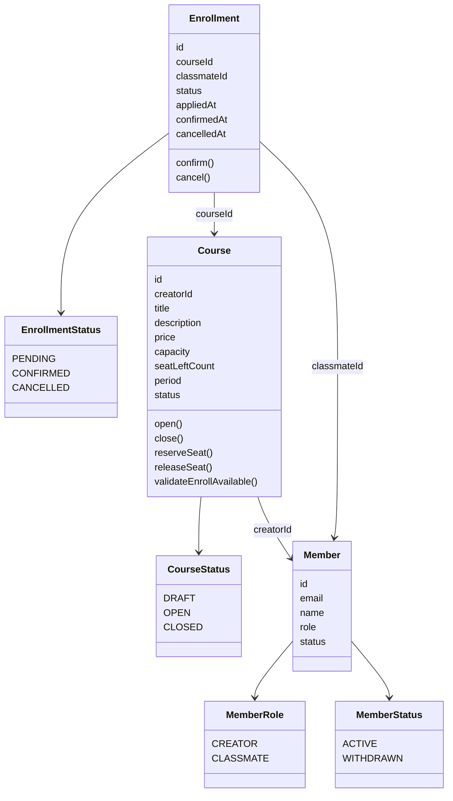
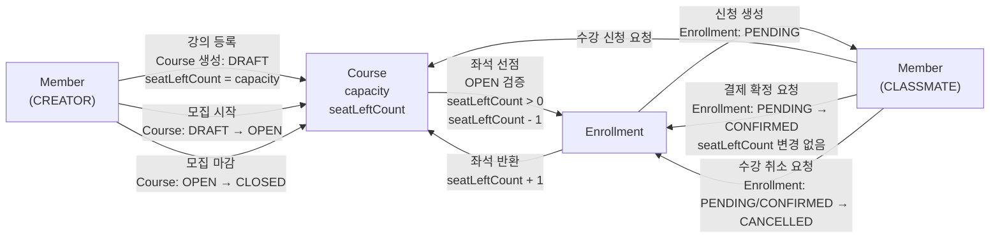

## 구현 범위

`Member`는 서비스 사용자를 나타냅니다.

`Member`는 `CREATOR` 또는 `CLASSMATE` 역할을 갖습니다.

role hierarchy상 `CREATOR` 가  `CLASSMATE`보다 상위입니다.

`CREATOR`는 강의를 등록하고 모집 상태를 변경할 수 있습니다.

`CLASSMATE`는 모집 중인 강의에 수강 신청할 수 있습니다.

`Course`는 강의를 나타냅니다.

`Course`는 `capacity`와 `seatLeftCount`를 갖습니다.

`capacity`는 최대 수강 가능 인원입니다.

`seatLeftCount`는 현재 남은 좌석 수입니다.

`Course`가 생성될 때 `seatLeftCount`는 `capacity`와 같은 값으로 시작합니다.

`Course`는 `DRAFT`, `OPEN`, `CLOSED` 상태를 갖습니다.

`Course`는 `DRAFT → OPEN → CLOSED` 방향으로만 상태가 변경됩니다.

`DRAFT` 상태의 `Course`는 수강 신청을 받을 수 없습니다.

`OPEN` 상태의 `Course`만 수강 신청을 받을 수 있습니다.

`CLOSED` 상태의 `Course`는 수강 신청을 받을 수 없습니다.

`Enrollment`는 클래스메이트가 강의에 신청한 기록입니다.

`Enrollment`는 `PENDING`, `CONFIRMED`, `CANCELLED` 상태를 갖습니다.

`Enrollment`는 생성될 때 `PENDING` 상태가 됩니다.

`PENDING` 상태는 신청 완료, 결제 대기 상태입니다.

`CONFIRMED` 상태는 결제 완료, 수강 확정 상태입니다.

`CANCELLED` 상태는 취소된 상태입니다.

`PENDING` 상태의 `Enrollment`는 `CONFIRMED`로 변경될 수 있습니다.

`PENDING` 또는 `CONFIRMED` 상태의 `Enrollment`는 `CANCELLED`로 변경될 수 있습니다.

`CANCELLED` 상태의 `Enrollment`는 다시 변경될 수 없습니다.

---

## 정원 관리 규칙

`Course`는 남은 좌석 수를 직접 관리합니다.

수강 신청이 성공하면 `Course`의 `seatLeftCount`는 1 감소합니다.

수강 취소가 성공하면 `Course`의 `seatLeftCount`는 1 증가합니다.

`seatLeftCount`는 0보다 작아질 수 없습니다.

`seatLeftCount`는 `capacity`보다 커질 수 없습니다.

`seatLeftCount`가 0이면 수강 신청은 거부됩니다.

`PENDING` 상태의 `Enrollment`도 좌석을 점유합니다.

`CONFIRMED` 상태의 `Enrollment`도 좌석을 점유합니다.

`CANCELLED` 상태의 `Enrollment`는 좌석을 점유하지 않습니다.

결제 확정은 좌석 수를 변경하지 않습니다.

수강 취소는 좌석 수를 반환합니다.

수강 신청과 `seatLeftCount` 감소는 하나의 트랜잭션 안에서 처리되어야 합니다.

수강 취소와 `seatLeftCount` 증가는 하나의 트랜잭션 안에서 처리되어야 합니다.

동시에 여러 클래스메이트가 마지막 좌석에 신청해도 `capacity`를 초과한 신청이 생성되면 안 됩니다.

이를 위해 수강 신청 처리 시 `Course`를 잠그고, 잠금 안에서 `seatLeftCount`를 확인한 뒤 감소시켜야 합니다.

---

## Domain Diagram

---

## Flow Diagram

---

## 구현해야 할 API

- [x] 회원가입 API를 구현합니다.

- [x] 로그인 API를 구현합니다.

- [x] 현재 로그인 회원 조회 API를 구현합니다.

- [x] 강의 API를 구현합니다.

- [x] 강의 등록 API를 구현합니다.

- [x] 강의 모집 시작 API를 구현합니다.

- [x] 강의 모집 마감 API를 구현합니다.

- [x] 강의 목록 조회 API를 구현합니다.

- [x] 강의 상세 조회 API를 구현합니다.
	- [x] 강의 상세 조회 응답에는 `capacity`와 `seatLeftCount`를 포함합니다.

- [x] 수강 신청 API를 구현합니다.
	- [x] 수강 신청 API는 `CLASSMATE`와 상위 권한인 `CREATOR` 역할의 회원이 사용할 수 있습니다.
	- [x] 수강 신청 API는 `OPEN` 상태의 강의에 대해서만 성공해야 합니다.
	- [x] 수강 신청 API는 `seatLeftCount`가 0이면 실패해야 합니다.
	- [x] 수강 신청 성공 시 `Enrollment`는 `PENDING` 상태로 생성됩니다.

- [x] 결제 확정 API를 구현합니다.
	- [x] 결제 확정 API는 `PENDING` 상태의 `Enrollment`만 `CONFIRMED`로 변경합니다.

- [x] 수강 취소 API를 구현합니다.
	- [x] 수강 취소 API는 `PENDING` 또는 `CONFIRMED` 상태의 `Enrollment`만 `CANCELLED`로 변경합니다.
	- [x] 수강 취소 성공 시 `Course`의 `seatLeftCount`를 1 증가시킵니다.

- [x] 내 수강 신청 목록 조회 API를 구현합니다.

---

## 도메인 행위 규칙

`Course`는 `open()` 행위를 가집니다.

`Course.open()`은 `DRAFT` 상태에서만 성공합니다.

`Course.open()`이 성공하면 `Course`는 `OPEN` 상태가 됩니다.

`Course`는 `close()` 행위를 가집니다.

`Course.close()`는 `OPEN` 상태에서만 성공합니다.

`Course.close()`가 성공하면 `Course`는 `CLOSED` 상태가 됩니다.

`Course`는 `reserveSeat()` 행위를 가집니다.

`Course.reserveSeat()`는 `OPEN` 상태에서만 성공합니다.

`Course.reserveSeat()`는 `seatLeftCount`가 1 이상일 때만 성공합니다.

`Course.reserveSeat()`가 성공하면 `seatLeftCount`는 1 감소합니다.

`Course`는 `releaseSeat()` 행위를 가집니다.

`Course.releaseSeat()`는 `seatLeftCount`가 `capacity`보다 작을 때만 성공합니다.

`Course.releaseSeat()`가 성공하면 `seatLeftCount`는 1 증가합니다.

`Enrollment`는 `confirm()` 행위를 가집니다.

`Enrollment.confirm()`은 `PENDING` 상태에서만 성공합니다.

`Enrollment.confirm()`이 성공하면 `Enrollment`는 `CONFIRMED` 상태가 됩니다.

`Enrollment`는 `cancel()` 행위를 가집니다.

`Enrollment.cancel()`은 `PENDING` 또는 `CONFIRMED` 상태에서만 성공합니다.

`Enrollment.cancel()`이 성공하면 `Enrollment`는 `CANCELLED` 상태가 됩니다.

---

## 동시성 요구사항

수강 신청은 반드시 트랜잭션 안에서 처리합니다.

수강 신청 트랜잭션에서는 `Course`를 먼저 조회하고 잠급니다.

잠근 `Course`에 대해 `reserveSeat()`를 호출합니다.

`reserveSeat()`가 성공한 경우에만 `Enrollment`를 생성합니다.

`Enrollment` 생성과 `seatLeftCount` 감소는 같은 트랜잭션에서 커밋됩니다.

동시에 여러 요청이 같은 강의의 마지막 좌석에 접근해도 하나의 요청만 성공해야 합니다.

수강 신청 중복을 막기 위해 같은 `courseId`와 `classmateId` 조합의 활성 신청이 중복 생성되지 않도록 처리합니다.

현재 모델에서는 한 클래스메이트가 같은 강의에 한 번만 신청할 수 있다고 가정합니다.

---

## 테스트 요구사항

강의 상태 전이 테스트를 작성합니다.

`DRAFT` 상태의 `Course`가 `OPEN`으로 변경되는지 검증합니다.

`OPEN` 상태의 `Course`가 `CLOSED`로 변경되는지 검증합니다.

`CLOSED` 상태의 `Course`가 다시 `OPEN`으로 변경되지 않는지 검증합니다.

수강 신청 테스트를 작성합니다.

`OPEN` 상태의 `Course`에 수강 신청하면 `Enrollment`가 `PENDING`으로 생성되는지 검증합니다.

수강 신청 성공 시 `seatLeftCount`가 1 감소하는지 검증합니다.

`DRAFT` 상태의 `Course`에는 수강 신청할 수 없는지 검증합니다.

`CLOSED` 상태의 `Course`에는 수강 신청할 수 없는지 검증합니다.

`seatLeftCount`가 0이면 수강 신청할 수 없는지 검증합니다.

결제 확정 테스트를 작성합니다.

`PENDING` 상태의 `Enrollment`가 `CONFIRMED`로 변경되는지 검증합니다.

결제 확정 시 `seatLeftCount`가 변경되지 않는지 검증합니다.

수강 취소 테스트를 작성합니다.

`PENDING` 상태의 `Enrollment`가 `CANCELLED`로 변경되는지 검증합니다.

`CONFIRMED` 상태의 `Enrollment`가 `CANCELLED`로 변경되는지 검증합니다.

수강 취소 성공 시 `seatLeftCount`가 1 증가하는지 검증합니다.

동시성 테스트를 작성합니다.

`capacity`가 1인 `Course`에 여러 클래스메이트가 동시에 수강 신청했을 때 하나의 신청만 성공해야 합니다.

`capacity`가 1000인 `Course`에 10000명이 동시에 수강 신청했을 때 성공한 `Enrollment` 수는 1000개여야 합니다.

동시성 테스트 이후 `seatLeftCount`는 0이어야 합니다.

---

## 구현 시 주의사항

도메인 객체는 가능한 한 자신의 상태 전이 규칙을 직접 가져야 합니다.

상태 변경을 외부에서 직접 대입하지 말고, `open()`, `close()`, `reserveSeat()`, `releaseSeat()`, `confirm()`, `cancel()` 같은 행위 메서드를 통해 변경하세요.

`Course`는 정원 규칙을 담당합니다.

`Enrollment`는 신청 상태 전이를 담당합니다.

`Member`는 사용자 식별과 역할을 담당합니다.

수강 신청 유스케이스는 `Member`, `Course`, `Enrollment`를 조합합니다.

`Course`와 `Enrollment` 변경은 하나의 트랜잭션으로 묶어야 합니다.

`seatLeftCount`는 `capacity`보다 커질 수 없고, 0보다 작아질 수 없습니다.

`seatLeftCount`는 전체 회원 수가 아니라 해당 강의에서 남은 좌석 수입니다.
