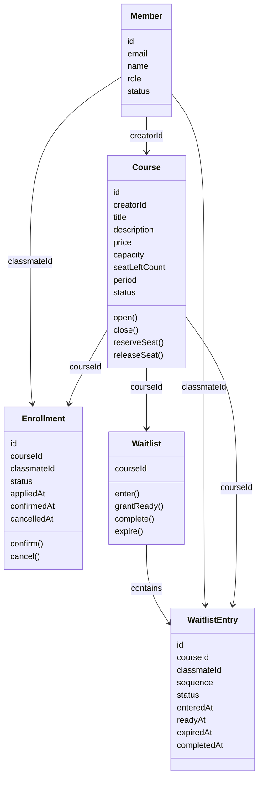
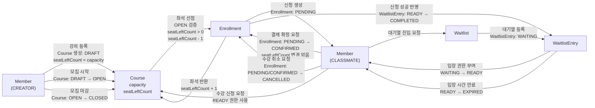
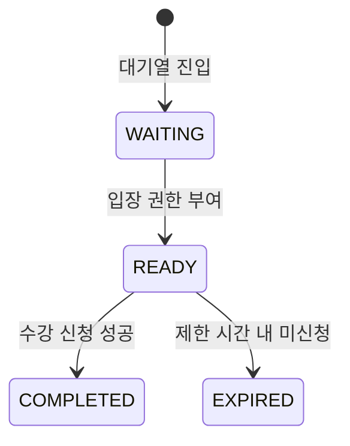
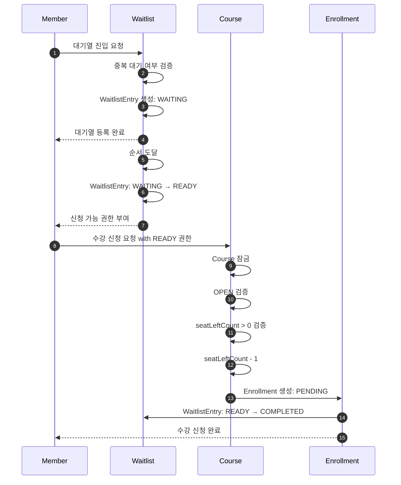

## Model 2 변경사항 명세서

`Model 2`는 `Model 1`의 `Member`, `Course`, `Enrollment` 구조를 유지하면서 `Waitlist`를 추가합니다.

`Model 1`은 `Course`가 `capacity`와 `seatLeftCount`를 갖고, 수강 신청 성공 시 `seatLeftCount`를 감소시키며, 수강 취소 성공 시 `seatLeftCount`를 증가시키는 구조입니다.

`Model 2`는 이 정원 관리 구조를 변경하지 않습니다.

`Model 2`는 부하가 몰릴 때 모든 수강 신청 요청이 즉시 `Course`로 들어가지 않도록 `Waitlist`를 추가합니다.

과제 A의 선택 구현에는 대기열 기능이 포함되어 있으므로, `Waitlist`는 추가 점수 목적의 확장 모델입니다.

---

## 1. 변경 목적

`Model 1`에서는 클래스메이트가 수강 신청을 요청하면 곧바로 `Course`의 좌석 선점 로직으로 진입합니다.

```text
CLASSMATE
→ Course.reserveSeat()
→ Enrollment 생성
```

이 구조는 정합성은 지킬 수 있지만, 동시에 많은 요청이 몰리면 `Course` 잠금 경합이 커질 수 있습니다.

`Model 2`는 `Waitlist`를 추가하여 수강 신청 요청을 순서대로 통제합니다.

```text
CLASSMATE
→ Waitlist 진입
→ READY 권한 획득
→ Course.reserveSeat()
→ Enrollment 생성
```

즉, `Waitlist`는 정원 관리를 대신하지 않고, **수강 신청 진입량을 제어하는 역할**을 합니다.

---

## 2. 추가 도메인

## Waitlist

`Waitlist`는 특정 `Course`에 대한 수강 신청 대기열입니다.

`Waitlist`는 클래스메이트의 실제 수강 신청을 바로 처리하지 않습니다.

`Waitlist`는 클래스메이트에게 수강 신청 가능 권한을 순서대로 부여합니다.

`Waitlist`는 `Course`의 정원 규칙을 대체하지 않습니다.

`Waitlist`는 부하 완화와 순서 제어를 담당합니다.

---

## WaitlistEntry

`WaitlistEntry`는 특정 클래스메이트가 특정 강의의 대기열에 들어간 기록입니다.

`WaitlistEntry`는 하나의 `Course`와 하나의 `Member`를 기준으로 생성됩니다.

`WaitlistEntry`는 대기 순서를 가집니다.

`WaitlistEntry`는 신청 가능 상태를 가집니다.

---

## 3. 변경된 도메인 다이어그램



---

## 4. 변경된 흐름 다이어그램



---

## 5. WaitlistEntry 상태 전이



`WAITING`은 대기열에 등록된 상태입니다.

`READY`는 실제 수강 신청 API를 호출할 수 있는 상태입니다.

`COMPLETED`는 수강 신청이 성공한 상태입니다.

`EXPIRED`는 입장 권한을 받았지만 제한 시간 내 신청하지 않은 상태입니다.

---

## 6. 기존 도메인 변경사항

## Member 변경사항

`Member`의 기본 역할 구조는 변경하지 않습니다.

`CREATOR`는 `CLASSMATE`보다 상위 역할입니다.

`CLASSMATE`는 대기열에 진입할 수 있습니다.

`CREATOR`도 상위 역할이므로 대기열에 진입할 수 있습니다.

`WITHDRAWN` 상태의 `Member`는 대기열에 진입할 수 없습니다.

---

## Course 변경사항

`Course`의 정원 관리 방식은 변경하지 않습니다.

`Course`는 계속 `capacity`와 `seatLeftCount`를 갖습니다.

`Course.reserveSeat()`는 기존처럼 최종 정원 검증을 담당합니다.

`Waitlist`가 있더라도 `Course.reserveSeat()` 검증은 생략할 수 없습니다.

즉, `READY` 권한이 있어도 `Course`가 `OPEN` 상태가 아니거나 `seatLeftCount`가 0이면 수강 신청은 실패합니다.

---

## Enrollment 변경사항

`Enrollment`의 상태 전이는 변경하지 않습니다.

`Enrollment`는 수강 신청 성공 시 `PENDING`으로 생성됩니다.

`Enrollment`는 결제 확정 시 `PENDING → CONFIRMED`로 변경됩니다.

`Enrollment`는 취소 시 `PENDING/CONFIRMED → CANCELLED`로 변경됩니다.

다만 `Model 2`에서는 `Enrollment` 생성 전에 `WaitlistEntry`가 `READY` 상태인지 검증해야 합니다.

---

## 7. 새로 추가되는 행위 규칙

## 대기열 진입

`Member`는 `Course`의 대기열에 진입할 수 있습니다.

`Course`가 `OPEN` 상태가 아니면 대기열에 진입할 수 없습니다.

이미 같은 `Course`의 대기열에 `WAITING` 또는 `READY` 상태로 존재하는 경우 중복 진입할 수 없습니다.

이미 같은 `Course`에 수강 신청한 경우 대기열에 진입할 수 없습니다.

대기열 진입이 성공하면 `WaitlistEntry`는 `WAITING` 상태가 됩니다.

---

## 입장 권한 부여

`Waitlist`는 대기 순서에 따라 `WaitlistEntry`를 `READY` 상태로 변경합니다.

`READY` 상태의 `WaitlistEntry`를 가진 회원만 실제 수강 신청 API를 호출할 수 있습니다.

`READY` 권한은 제한 시간을 가집니다.

제한 시간 안에 수강 신청하지 않으면 `WaitlistEntry`는 `EXPIRED` 상태가 됩니다.

---

## 수강 신청 성공 처리

`READY` 상태의 `WaitlistEntry`를 가진 회원이 수강 신청에 성공하면 `Enrollment`가 `PENDING`으로 생성됩니다.

수강 신청이 성공하면 `WaitlistEntry`는 `COMPLETED` 상태가 됩니다.

수강 신청 성공 시 `Course.seatLeftCount`는 1 감소합니다.

---

## 입장 권한 만료

`READY` 상태의 `WaitlistEntry`가 제한 시간 안에 사용되지 않으면 `EXPIRED` 상태가 됩니다.

`EXPIRED` 상태가 되면 해당 권한으로는 수강 신청할 수 없습니다.

다시 신청하려면 새로 대기열에 진입해야 합니다.

---

## 8. Model 2의 수강 신청 처리 순서



---

## 9. 동시성 변경사항

`Model 2`에서도 정원 초과 방지는 `Course`가 담당합니다.

`Waitlist`는 동시에 많은 요청이 `Course`로 들어오지 않게 줄여줄 뿐입니다.

수강 신청 트랜잭션에서는 기존처럼 `Course`를 잠가야 합니다.

```text
Course 잠금
→ WaitlistEntry READY 검증
→ Course.reserveSeat()
→ Enrollment 생성
→ WaitlistEntry COMPLETED 처리
→ commit
```

`Enrollment` 생성, `Course.seatLeftCount` 감소, `WaitlistEntry` 완료 처리는 하나의 흐름으로 처리되어야 합니다.

---

## 10. Model 2 요약

`Model 2`는 `Model 1`에 `Waitlist`와 `WaitlistEntry`를 추가합니다.

`Waitlist`는 수강 신청 부하를 완화합니다.

`Waitlist`는 수강 신청 순서를 제어합니다.

`Waitlist`는 `READY` 상태의 회원만 실제 신청으로 진입시킵니다.

`Course`는 여전히 최종 정원 검증을 담당합니다.

`Enrollment`는 여전히 수강 신청 상태 전이를 담당합니다.

`Model 2`의 핵심은 다음과 같습니다.

```text
Waitlist는 부하를 제어한다.
Course는 정원을 지킨다.
Enrollment는 신청 상태를 관리한다.
```
